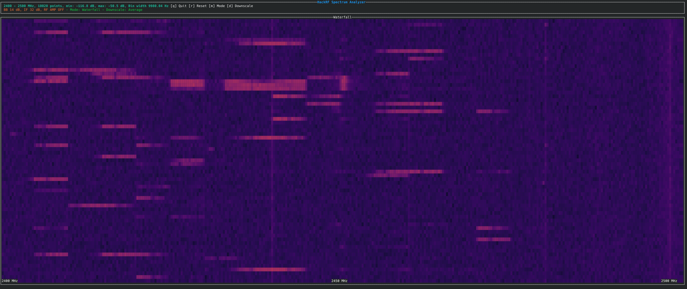
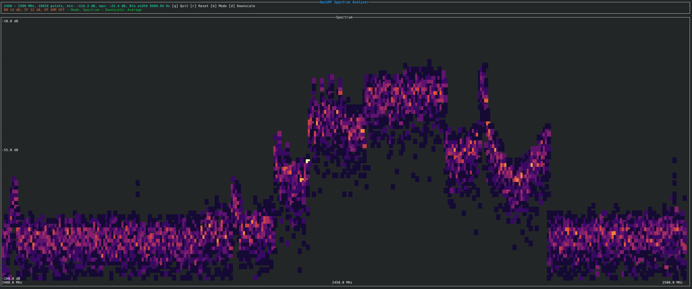

# HackRF Spectrum Analyzer



## image_logger

```bash
cargo run --release --bin image_logger -- --help
```

A spectrum logger using HackRF SDR hardware that generates waterfall visualizations of RF spectrum data.

This binary creates a (very high resolution) tiff image file with the waterfall representation of the received spectrum while the program is running.


Visualization output is saved to `/tmp/sweep.tiff` and updated in real-time.

This is useful for long term logging.

### Example

Scan from 2400 MHz to 2500 MHz with 100 kHz resolution:

```bash
cargo run --release --bin image_logger -- --freq-min 2400 --freq-max 2500 --bin-width 100000 --gain 20 --lna-gain 16
```

## tui

```bash
cargo run --release --bin tui -- --freq-min 2400 --freq-max 2500 -w 10000
```

A real time spectrum visualizer for the hackrf

CLI options are the same as the image_logger

Press m to switch from waterfall to graph



